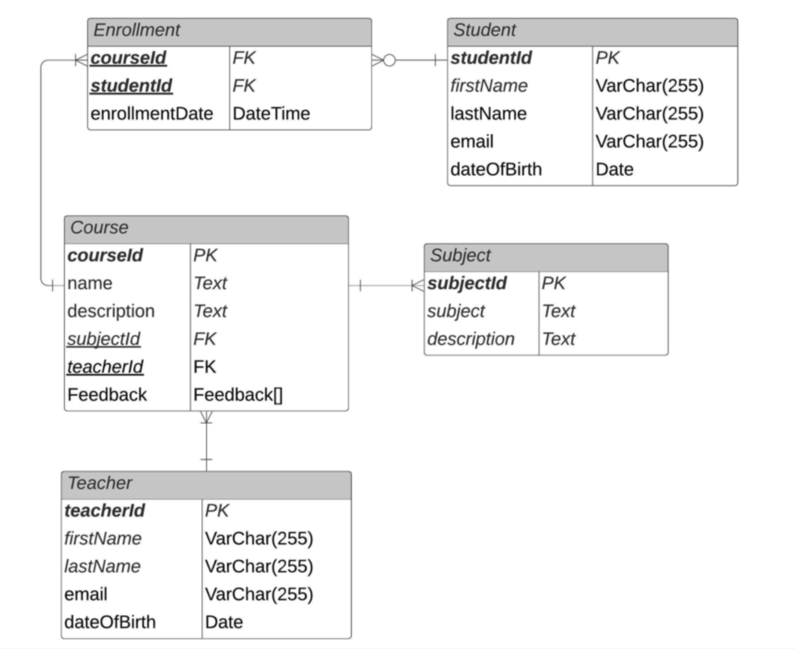
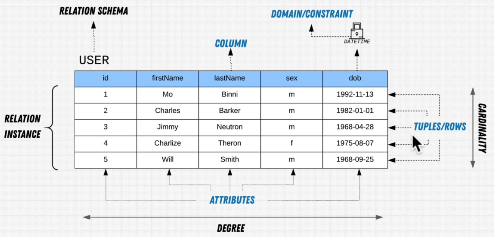
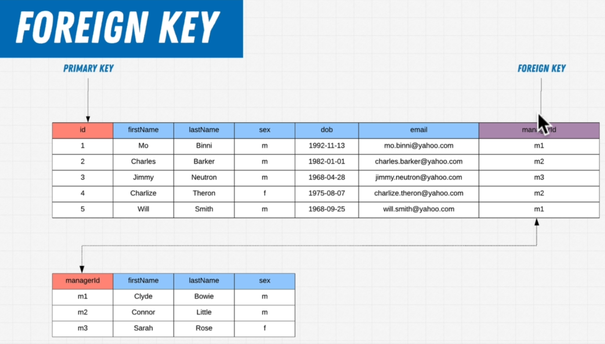
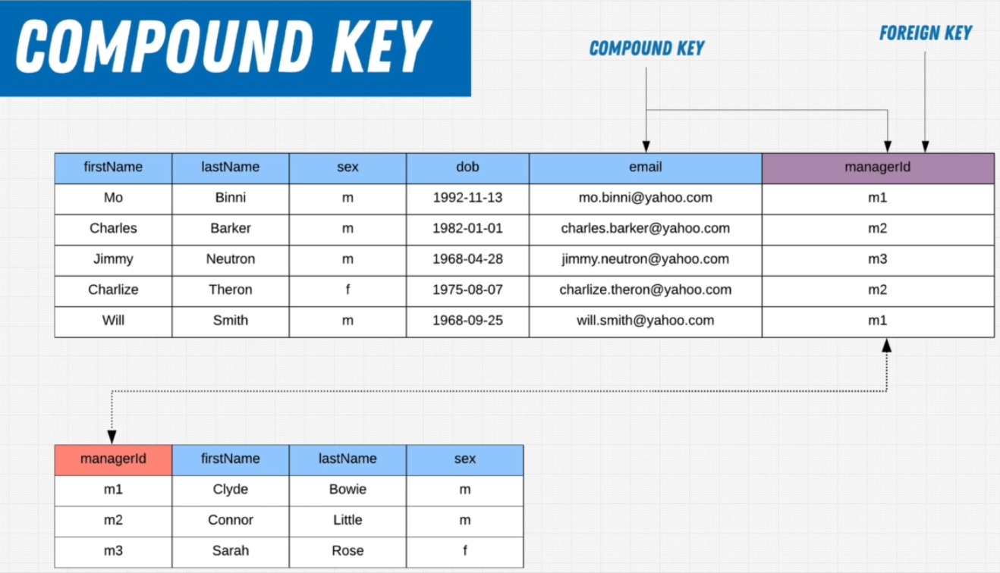
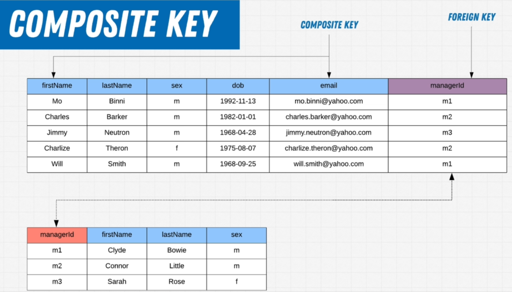
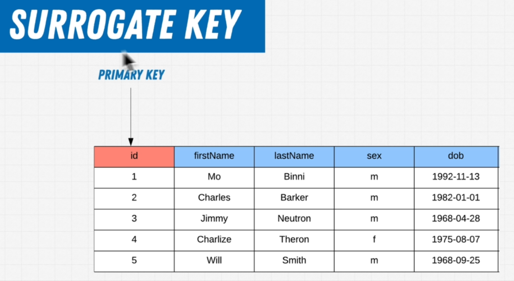

# Database System Design

### SDLC(Software Development Life Cycle)

1.Phase 1
  * System Planning and Selection
  * Requirement Analysis
    * Info on What needs to be done

2.Phase 2
  * System Analysis
    * On time and budget

3.Phase 3
  * Design the System architecture
    * Databases, Apps etc

4.Phase 4
  * System Implementation and Operation
    * Building the Software and Testing

* Phase 1 and 2: Business people
* Phase 3 and 4: Developers

### Database Design

* Top Down
* Bottom Up

### Top Down

* Starting from Zero
* Optimal choice when creating a new Database
* All requirements are gathered Up-Front

### Bottom Up
* There's an existing system or specific data in place
* E.g Doctor and Symptoms
* Shape a **new system** around the **existing data**
* Optimal choice when migrating an existing database

### What to Use
* Often you'll end up using a bit of both

### Check DriveMe Academy video to learn about General SDLC planning and analysis

### Case Study of DriveMe Academy: Core Requirements

* There is a Vehicle Inventory for Students to Rent
* There are Employees at every branch
* There is maintenance for the vehicles
* Optional exam at the end of your lessons
* You can only take the exam twice, fail twice and you must take more lessons

### How do we model a database(What I thought)

* Vehicle Entity: (name, type, cid, status: maintenance, acquired, free)
* Employees: (eid, name, contact, address)
* Customer: (id, name, contact, address)
* Exam: (cid, status)

### Top down Design

* **Goal**: To Create a Data Model based on Requirements
* Requirements: What are we looking for?
  * High-Level Requirements
    * Based on communication with client
  * User Interviews
    * Talk with Users and get the Requirement
  * Data Collection
  * Deep Understanding
* **Key method**: ER-Modelling

### ER model

* Entity Relationship model
* Diagram to structure high level requirements

### Tooling for Diagramming

* UMLet 
* LucidChart
* draw.io now app.diagrams.net(What I thought)

#### Step 1: Entities

* Determine what entities are in the System
* **What is an Entity**
  * A person/place or thing
  * Has a singular name
  * Has an Identifier
  * Should contain more than one instance of data

##### DriveMe Academy Entities

* Link: https://app.diagrams.net/#Hnuthanc%2Fwebdev%2Fdb_sd%2FDriveMe.drawio
* Student
* School(Branch)
* Instructor
* Vehicle
* For Maintenance, we frame questions like what would it hold
  * Date of maintenance(If only this were present, it could have been added in Vehicle entity)
  * What kind of maintenance
  * Who did it
  * Where did it happen
  * Since we have multiple columns, we have Maintenance also as an entity
* Exam
* Lesson

##### Relationships

* School has Instructor
* School has Student
* Student takes Lesson
* Instructor teaches Lesson
* Vehicle has Maintenance

#### Step 2: Attributes

* Give Entities the Information they will store
* **What are Attributes**
  * Must be a property of the entity
  * Must be Atomic
    * Narrowing down to the most small
  * Single/Multivalued (Phone NR)
  * Keys

##### Relation Schema and Instance

* Relation Schema is the Table Schema(Representation of data going into the table)
* For eg.: Relation Schema for User table is id, firstName, lastName, sex and dob
* Relation Instance is the set of data that relates to the Relation Schema

##### Relation Key

* Purpose: Uniquely identify each and every row in turn uniquely identify the relationship

##### Super Key

* **Any combination of attributes** that could uniquely identify a row
* Examples:
  * id and firstName
  * id and email
  * firstName and email
  * id, firstName and lastName
  * id, firstName, lastName and sec
  * etc

##### Candidate Key

* Subset of Super Key
* The **minimum amount of attributes** that are needed to uniquely identify a row
* Examples:
  * email
  * id

##### Primary Key

* Relation key that uniquely identifies the relationship
* 2 candidate keys: id and email

##### Foreign Key

* Reference a primary key from a different table
* Link manager to employees using managerId

##### Compound Key

* More than 1 column and that includes a foreign key uniquely identifying the data

##### Composite Key

* More than 1 column and that does not include the foreign key uniquely identifying the data

##### Surrogate Key

* Key which has Nothing to do with the individual's data
