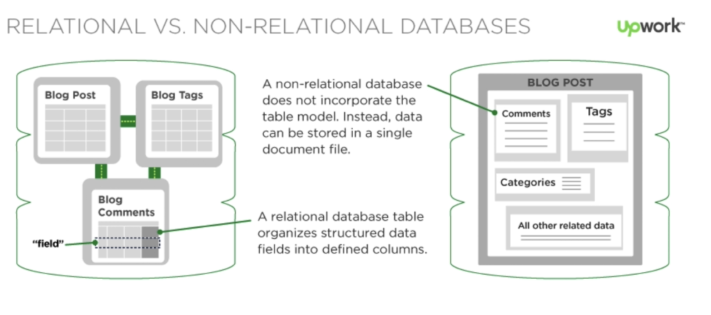

### Getting started

* npx create-react-app client
* Check more in client's README
* Create api folder and npm init -y
* Check more in api's README

### Connecting front and back-end

* Running both client and server(api)
* npm start on both the folders
* In real life, they may be on different computers and they communicate via http
* Need npm package of cors to avoid CORS error

### Author's repos

* https://github.com/aneagoie/face-recognition-brain-api
* https://github.com/aneagoie/face-recognition-brain

### Database


* MongoDB: Stores documents (like user1.txt, user2.txt)
* SQL like Postgres: Stores tables (like user.txt, tweet.txt)

### Installing PostgreSQL

* Google search for psequel for mac
```sh
brew update
brew doctor
brew install postgresql
```
* Start postgresql
```sh
brew services start postgresql
```
* Creating and connecting to database
```sh
createdb 'test'
psql 'test'

# Create table
CREATE TABLE users (name text, age smallint, birthday date)
CREATE TABLE login (
  ID serial NOT NULL PRIMARY KEY,
  secret VARCHAR(100) NOT NULL,
  name text UNIQUE NOT NULL
);

# To see tables
\d

# Insert
INSERT INTO users (name, age, birthday) VALUES ('Nuthan', 24, '1997-02-27');
INSERT INTO users (name, age, birthday) VALUES ('Andrei', 31, '1990-01-25');
INSERT INTO users (name, age, birthday) VALUES ('John', 41, '1980-07-05');
INSERT INTO users (name, age, birthday) VALUES ('Amy', 15, '1935-04-04');
INSERT INTO login (secret, name) VALUES ('abc', 'Nuthan');
INSERT INTO login (secret, name) VALUES ('xyz', 'Sally');
INSERT INTO login (secret, name) VALUES ('lol', 'John');

# Select
SELECT * FROM users;
SELECT name, age, birthday FROM users;
SELECT * FROM users WHERE name LIKE 'A%';
SELECT * FROM users WHERE name LIKE '%n';

# ALTER
ALTER TABLE users ADD score smallint;

# UPDATE
UPDATE users SET score = 50 WHERE name = 'Andrei';
UPDATE users SET score=100 WHERE name='Nuthan' OR name='John';

# ORDER BY
SELECT * FROM users ORDER BY score DESC;

# FUNCTIONS
SELECT AVG(score) FROM users;
SELECT SUM(age) FROM users;
SELECT COUNT(name) FROM users;

# JOIN
SELECT * FROM users JOIN login ON users.name = login.name;

# DELETE
DELETE FROM users WHERE name='Andrei';

# DROP
DROP TABLE login;
DROP TABLE users;
```