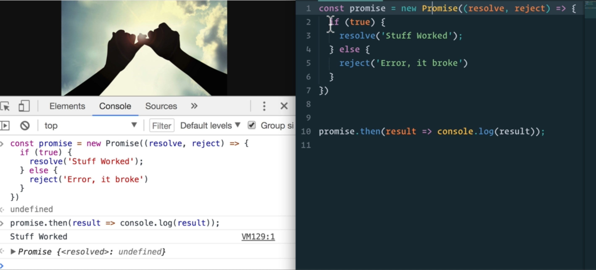
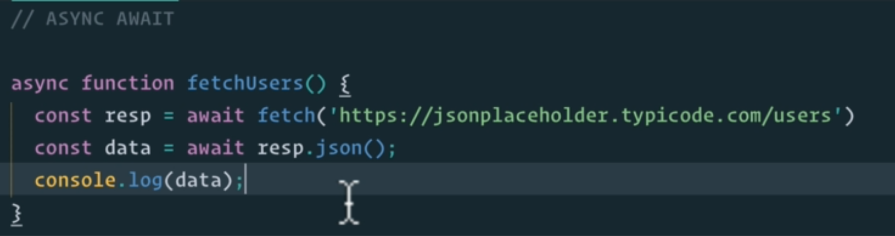

### HTTP

* HTTP is a common language that a client and server can use to communicate
* Requests and Responses
* Requests
  * GET
  * POST
  * PUT
  * DELETE
* Response
  * Status Code
  * HTML, CSS, JS documents etc

### HTTPS

* The password if sent is present in Query Parameter of Request body
* A malicious can get this if they are monitoring our network
* But if we use HTTPS, the message is encrypted
* Uses TLS(Transport Layer Security) or its predecessor SSL(Secure Socket Layer)

### JSON

* We needed a standard way of sending data
* For ex: if we send JS object, then the backend server which may be Python won't understand it
* So we have JSON and XML, but JSON is more efficient
* JSON is text, written with Javascript object notation

### AJAX

* AJAX = Asynchronous JavaScript And XML.
* It uses a browser built-in XMLHttpRequest object to request data from web server
* Server sends a Response back(in form of JSON or XML) to the Browser
* The response is read by JavaScript and Proper action (like page update) is performed by JavaScript
* Single Page Applications(Base page and then dynamic contents) 

### Promise

* A Promise is an object that may produce a single value some time in the future
* Either a resolved value, or a reasone that it's not resolved(rejected)

* .catch catches any of errors in the then statement
* 3 states
  * Fulfilled
  * Rejected
  * Pending

### Async Await

* To make it look like synchronous programming
* Looks Cleaner

